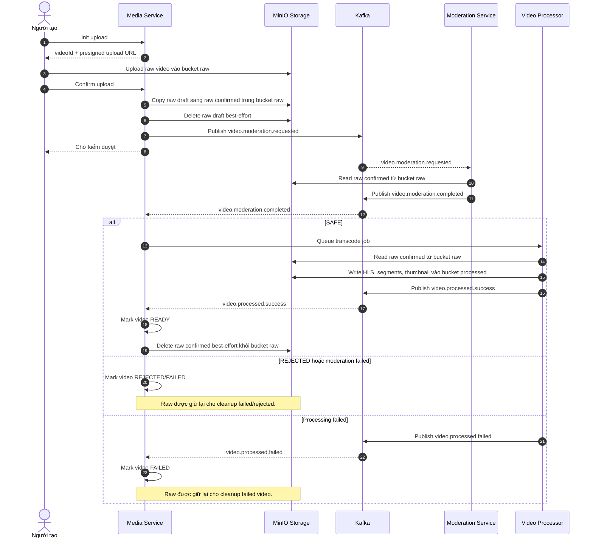

# Biểu đồ tuần tự

## Quy tắc vẽ biểu đồ

- Mỗi hệ thống, service, storage, broker, database hoặc actor thật chỉ được biểu diễn bằng một participant duy nhất.
- Không tách cùng một đối tượng thành nhiều participant theo bucket, topic, namespace, trạng thái hoặc vai trò logic.
- Nếu cần phân biệt phần logic bên trong cùng một đối tượng, ghi rõ trong message hoặc note thay vì tạo participant mới.
- Nội dung mô tả trong biểu đồ sử dụng tiếng Việt.
- Chỉ giữ tiếng Anh cho tên service, tên trạng thái, topic/event, endpoint, bucket/object key và thuật ngữ chuyên môn như `raw`, `processed`, `best-effort`, `transcode`, `cleanup`.
- Ví dụ đúng: dùng một participant `MinIO Storage`, message ghi rõ thao tác với `bucket raw` hoặc `bucket processed`.
- Ví dụ sai: tạo riêng `MinIO Raw` và `MinIO Processed`, vì dễ bị hiểu nhầm là hai storage service khác nhau.

## Tải video lên

### Vòng đời file raw

- `uploads/raw/{channelId}/...` được tạo khi khởi tạo upload và dùng cho URL upload của client.
- Khi xác nhận upload, raw draft được sao chép sang `uploads/confirmed/{videoId}/...`, sau đó raw draft được xóa best-effort.
- Sau `video.processed.success`, Media Service xóa raw confirmed best-effort sau khi video được đánh dấu `READY`.
- Nếu xóa trên MinIO lỗi, playback vẫn chạy từ `media-processed`; raw có thể còn lại để cleanup thủ công hoặc lifecycle cleanup.
- Video failed, rejected, draft bị hủy, draft hết hạn và hard-deleted dùng các luồng cleanup raw riêng.
- Diagram chỉ dùng một `MinIO Storage`; `raw` và `processed` là các bucket/object namespace khác nhau trong cùng storage service.
