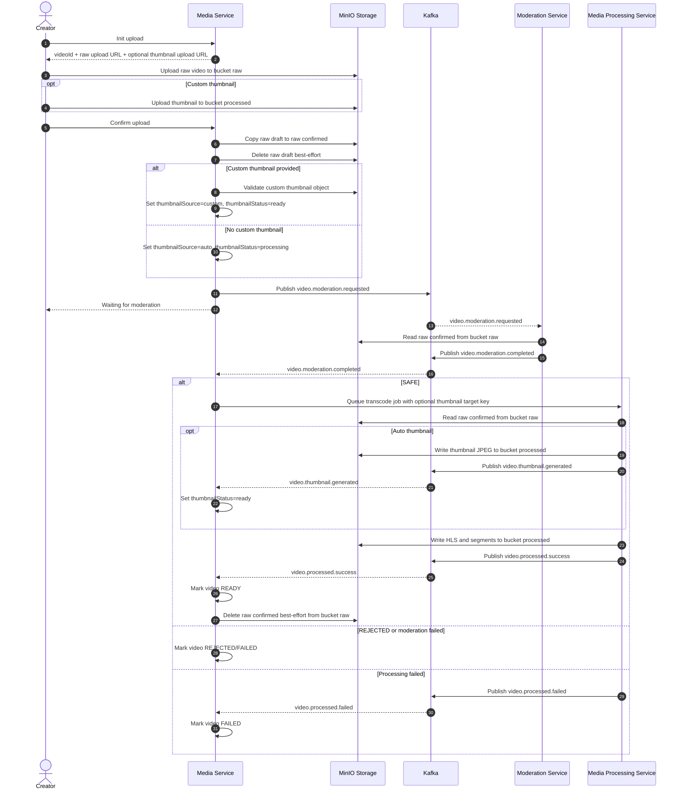

# Bieu do tuan tu

## Quy tac ve bieu do

- Moi actor/service/storage/broker/database chi nen co mot participant duy nhat.
- Phan biet bucket, topic, namespace, status bang message hoac note, khong tao participant moi.
- Ten service, topic/event, endpoint, bucket/object key va thuat ngu chuyen mon giu tieng Anh.

## Tai video len

## Raw file lifecycle

- `uploads/raw/{channelId}/...` is created by `init-upload` and used by the client presigned upload URL.
- `confirm-upload` copies the draft object to `uploads/confirmed/{videoId}/{uuid}.mp4`.
- After `video.processed.success`, Media Service deletes the confirmed raw object best-effort.
- If MinIO delete fails, playback still uses bucket `processed`; leftover raw objects can be cleaned manually or by lifecycle cleanup.
- Failed, rejected, cancelled draft, expired draft and hard-deleted videos use their own cleanup flows.

## Thumbnail flow

- Custom thumbnail:
  - Client calls `POST /api/media/videos/init-upload` with `thumbnailExtension`.
  - Media Service returns `thumbnailObjectKey` and `thumbnailUploadUrl`.
  - Client uploads the image to bucket `processed`.
  - Client sends `thumbnailObjectKey` on `confirm-upload`.
  - Media Service validates prefix, extension and size, then sets `thumbnailSource = custom`, `thumbnailStatus = ready`.
  - Late auto thumbnail events never overwrite custom thumbnails.

- Auto thumbnail:
  - If `confirm-upload` has no `thumbnailObjectKey`, Media Service sets `thumbnailSource = auto`, `thumbnailStatus = processing`.
  - After moderation `SAFE`, Media Service enqueues the transcode job with target key `videos/{videoId}/thumbnails/default.jpg`.
  - Media Processing Service uses FFmpeg to capture a frame, uploads JPEG to bucket `processed`, then publishes `video.thumbnail.generated`.
  - Media Service consumes `video.thumbnail.generated` and updates `thumbnailUrl`, `thumbnail_object_key`, and `thumbnailStatus = ready`.
  - If generation fails after retry, Media Processing Service publishes `video.thumbnail.failed`; Media Service sets `thumbnailStatus = failed` and clients should render a placeholder.
